# HumanGL
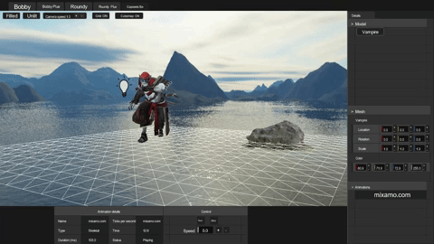

3D Engine with skeletal animations

## Summary

* [Introduction](#introduction)
* [Technologies](#technologies)
* [Features](#features)
* [Installation](#installation)
* [How to use](#user%20guide)
* [Authors](#authors)

## Introduction

Following [scop](https://github.com/lnicosia/scop), the first OpenGL project from 42, the students must now code their own vector and matrix library to implement hierarchical models and solid animations.

## Technologies

This simple program is coded in C++ with the OpenGL API. The engine is written in an external [Not real engine](https://github.com/lnicosia/notrealengine) library for flexibility. Check its repository for more information.

## Features

### Models
The application can be launched without input file. Only the hard coded assets will be present: 4 cube-constructed characters with small specificities:
* Bobby - The most basic character, made of 1x1x1 cubes (with transformations). It fulfills the mandatory part of the 42 project.

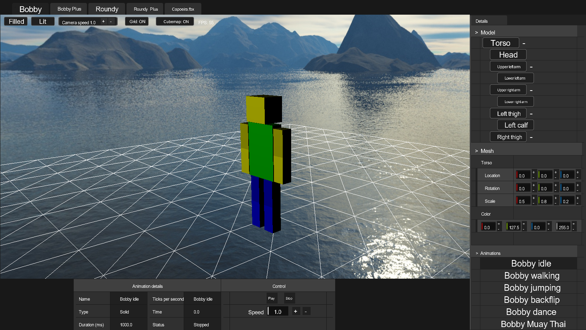

* BobbyPlus - Just like Bobby, it is made of 1x1x1 cubes. But this time, the character has more members.

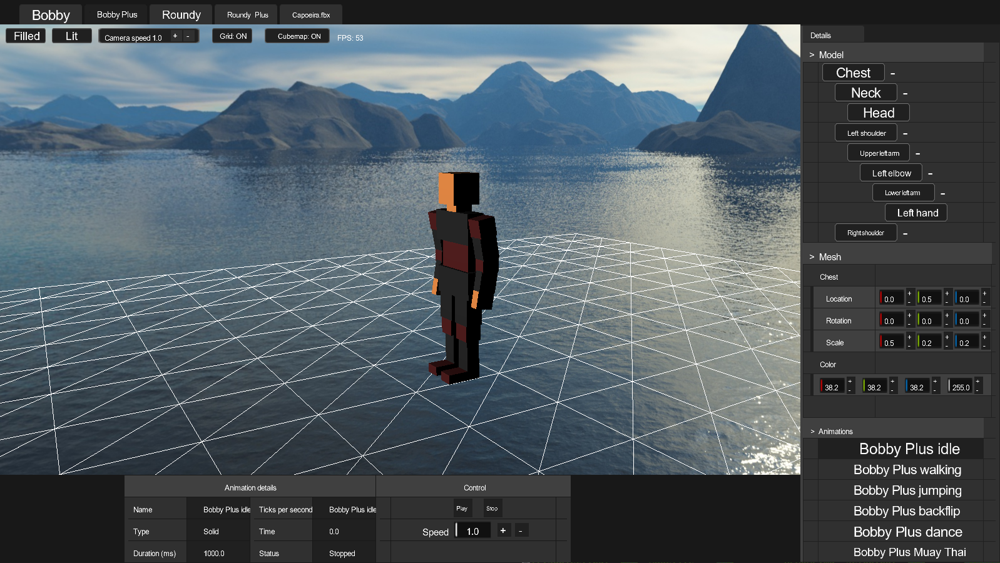

* Roundy - Same as Bobby but made from spheres instead of cubes.

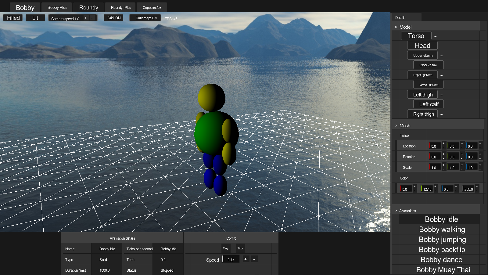

* RoundyPlus - Judy like BobbyPlus to Bobby, roundy plus is made of spheres but has more members.

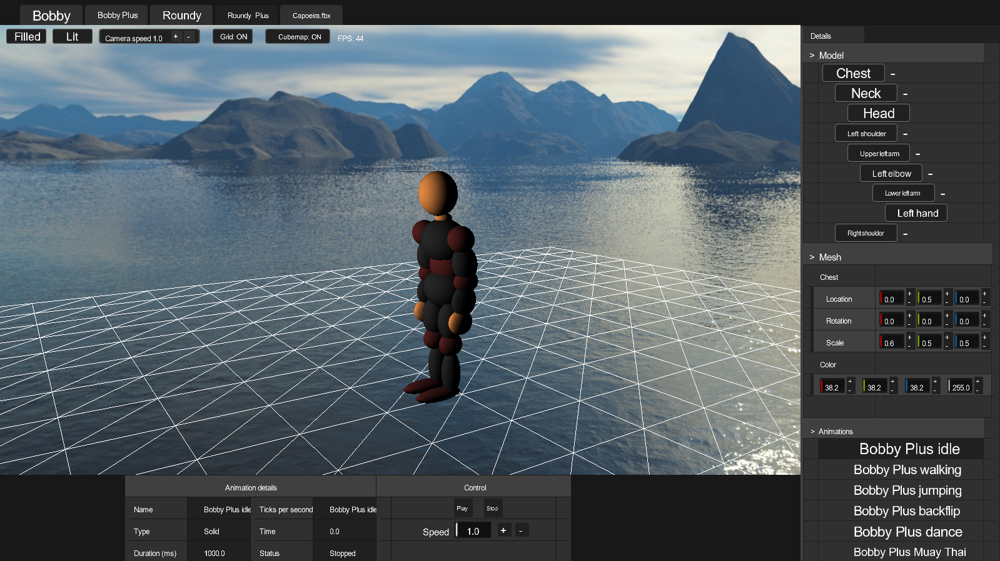

### Hierarchal members
The hierarchical tree is displayed on the right. You can select any mesh and apply transformations to it to see how the tree works. For example, if you scale the root mesh, the whole model is going to be scaled.

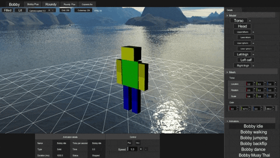

### Animations

At the bottom right of the screen, you can select animations. There are 6 animations for the hard coded models. For the loaded ones, it depends on the loaded files.

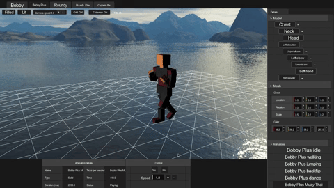

### Skeletal models

You can also load models and animations.

### Miscellaneous

You can enable or disable the following features:
* Lighting

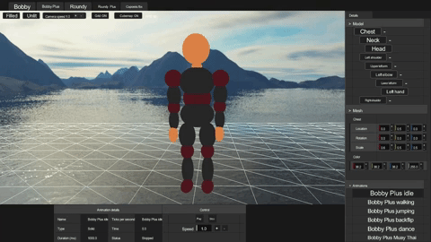

* Skybox/Cubemap

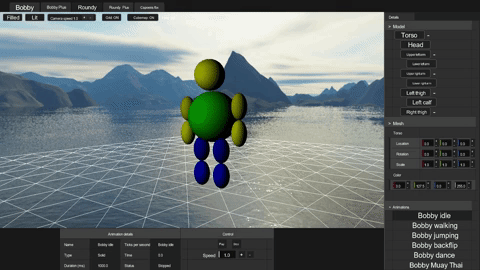

* Wireframe

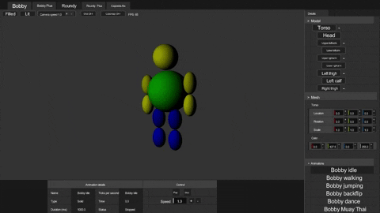

* Grid

You can also pause or change the animation speed

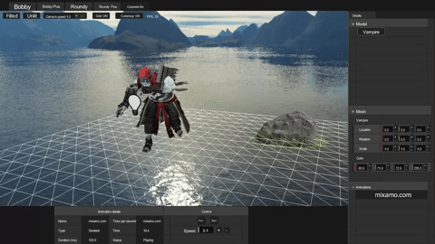

## Installation

Tested on Linux, Windows 10 and WSL (needs an X server like Xming).

OpenGL 4.0 is required (hence it is not going to work on Virtual Box's Linux machines since they can handle OpenGL 3.3 at most).

### Linux, WSL

A `clang` version compatible with C++20 is required.

Run `make`. It will produce a `humangl` binary.

### Windows

Cmake is required.
Run `Setup.bat` from cmd or the file explorer.
Build the solution in the `windows/` folder. It will produce a `HumanGL.exe` binary located in `windows\x64\[Config]\` where [Config] is the configuration you built the project with.

## How to use

Run `./humangl` on Linux or `HumanGL.exe` from the root folder on Windows. You can launch the program without arguments. It will only load the hard coded models. If you give a file as an argument, the program will load any object and animation found in the first given file. You can add more animations in the next arguments. If they are compatible with the model, you will be able select and launch them from the animation selection interface.

## Authors

Neyl Jaber (https://github.com/42njaber)

Lucas Nicosia (https://github.com/lnicosia)
